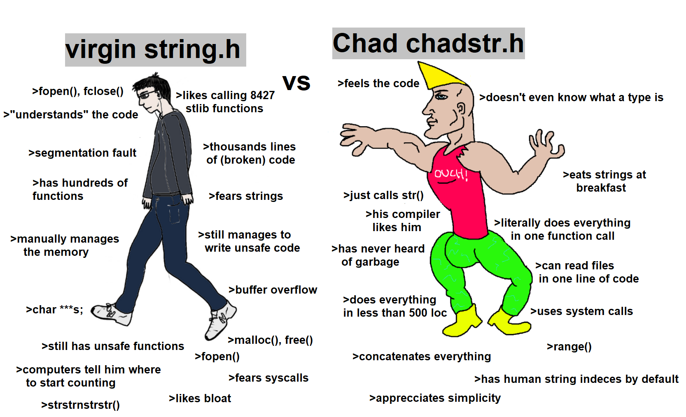

# chadstr.h
### Chad Strings - The Chad way to handle strings in C.

One ```str(...)``` macro to handle them all.

### Examples Usage:
```c
int table = 13;
int id = 37; 
str test1 = str("SELECT * FROM ", table, " where person_id ", id);
str test2 = str(test1);         //copies test1 to test2
str test3 = str(test2, test1); // returns concat of test2 and test1

test2 = test1; // acceptable, but wrong since test2 now points to test1 not copies it.

str(*test1); // returns const char* to use in printf like functions
Ex: puts(str(*test1)); // prints test1;
```
*"Why yes, i don't free(), OS cleans all memory for me, how did you know?"*

<p>
  
</p>

```c
free(test1); // will free memory for whole str.
```
*"Whoa, whoa, wait bro. But how about freeing str->data field?"*

While allocating memory for 'str' struct itself it also reserves space beneath it to store that string.
str->data points to that location. So freeing str itself also frees memory located at str->data.

If your compiler does support ```"__attribute__((cleanup()))"``` *("aahem gcc/clang")*, strings can be auto free'd while defined this way:
```c
autofree str test1 = str("apple");
...
// no free(test1); !!!
```
or
```c
chadstr test2 = str("pineapple");
...
// no free(test2); !!!
```
## Operations on Chad Strings:
Instead of writing shitload of different functions for some specific task, you can utilize already existing tools in your OS to do that for you.

<p>
  
</p>

### Examples Usage:
```c
cmd CMD = (cmd){"echo"}
chadstr test1 = str("orange apple");
chadstr pipecmd = str(" | cut -z -d \" \" -f1 "); 
chadstr result = str(CMD, test1, pipecmd); // "echo orange apple | cut -z -d " " -f1" as you would do in shell

/* chadstr result = str((cmd){"echo"}, test1, pipecmd); is also acceptable */

puts(str(*result));
```
File embedding has never been easier with ChadSTR:
```c
cmd CAT = (cmd){"cat"};
chadstr file = str(CAT, "README.md"); // cat README.md

puts(str(*file));
```
ChadSTR also has utility function ```range()``` to select range of string:

```c
chadstr test1 = str("pineapple"); 
chadstr test1range = str((range)(test1, 3,6)); // eapp

/*
 * If you are comfortable with range starting at index 1,
 * #define HUMAN_RANGE before #include "chadstr.h"
 * Note: negative end indices are still in "human" format 
 * starting at 1 no matter HUMAN_RANGE defined or not.
*/

#define HUMAN_RANGE
#include "chadstr.h"

...

chadstr test1 = str("pineapple"); 
chadstr test1range = str((range)(test1, 3,6)); // neap

```
Another example on generating random string with buffer and per char copying:
```c
#include <time.h>
#include <stdio.h>
#include <string.h>
#include <stdlib.h>
#include "chadstr.h"

str random_string(size_t length)
{
    chadstr pool = str("ABCDEFGHIJKLMNOPQRSTUVWXYZ");
    size_t randindex;
    size_t i;

    struct timespec ts;
    clock_gettime(CLOCK_MONOTONIC, &ts);

    /* using nano-seconds instead of seconds */
    srand((time_t)ts.tv_nsec);

    char buffer[length+1];

    for(i = 0; i < length; ++i)
    {
        randindex = rand() % pool->len;
        buffer[i] = pool->data[randindex] ^ ((rand() % 2) ? 0 : 0x20);  
    }

    buffer[i] = '\0';

    return str(buffer);
}

int main(void)
{
    for (int i = 0; i < 1000; ++i)
    {
        chadstr s = random_string(120);
        puts(str(*s));
    }
    return 0;
}
```

### PRs are welcomed.
